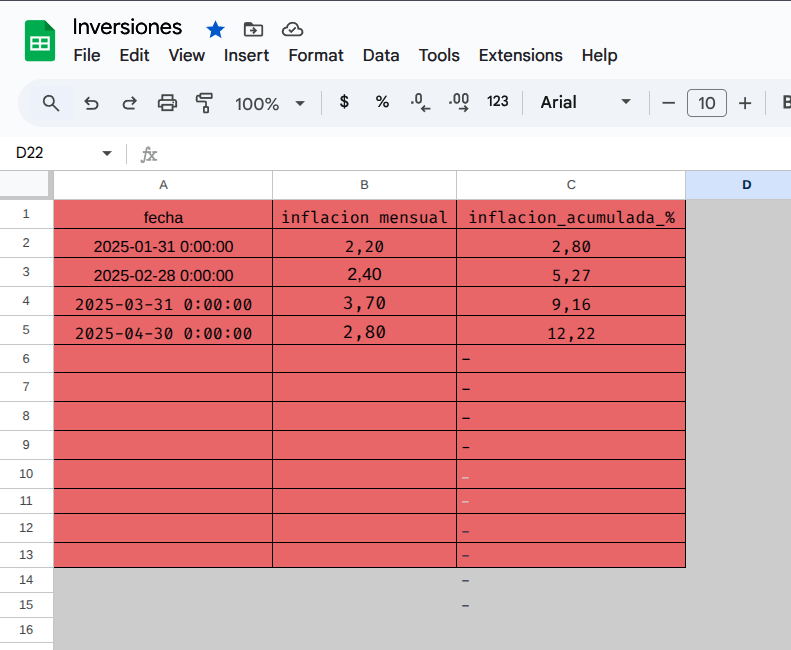
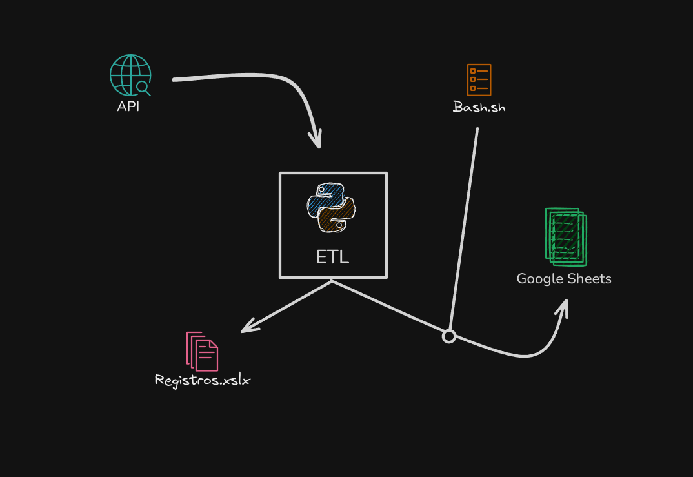

# Inflation Tracking in Argentina with Python and Google Sheets




This project automates the monthly collection of inflation data published by the Central Bank of the Argentine Republic (BCRA) API, processes it, and exports it directly to a Google Sheets spreadsheet to facilitate analysis and visualization.

## Objective

To have a tool that allows you to:

* Automatically obtain monthly inflation data from the BCRA API.
* Calculate the accumulated inflation.
* Export the processed data to Google Sheets.
* Avoid repetitive manual tasks such as downloading and copying data from Excel.

## Features

* Direct connection to the BCRA public API.
* Data processing with `pandas`.
* Authentication with Google through service accounts.
* Automatic export to a specific Google Sheets spreadsheet.
* Local record in Excel if you want to keep an offline copy.

## Technologies Used

* Python 3.12
* pandas
* numpy
* requests
* gspread
* gspread_dataframe
* openpyxl
* Google Cloud Service Account (for authenticating access to Sheets)

## Project Structure


```
infla\_script/
├── infla.py                 # Main script
├── credentials.json         # Service account key (should not be uploaded to the repository)
├── inflacion\_mensual.xlsx   # Local output file (optional)
└── requirements.txt         # Dependencies list
```


## Environment Setup

1. Create a virtual environment:

```bash
   python -m venv infla_env
   source infla_env/bin/activate  # Linux/macOS
   infla_env\Scripts\activate     # Windows
```

2. Install dependencies:

```bash
   pip install -r requirements.txt
```

3. Create a service account in Google Cloud and download the key in JSON format.

4. Share the Google Sheets document with editor permissions to the service account email.

5. Add the `credentials.json` file to the root of the project or create an environment variable and ensure it is not uploaded to GitHub.

## Usage

Run the script:

```bash
python infla.py
```

This will:

* Call the BCRA API.
* Process the monthly inflation data.
* Calculate the accumulated inflation.
* Export everything to a predefined Google Sheets document.


